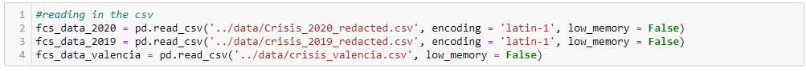
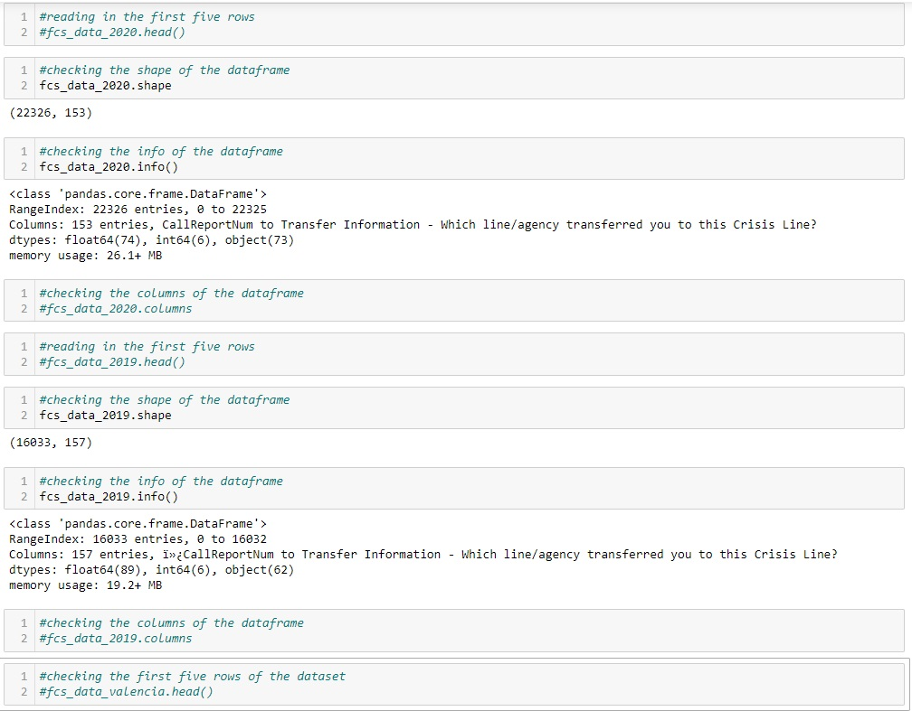
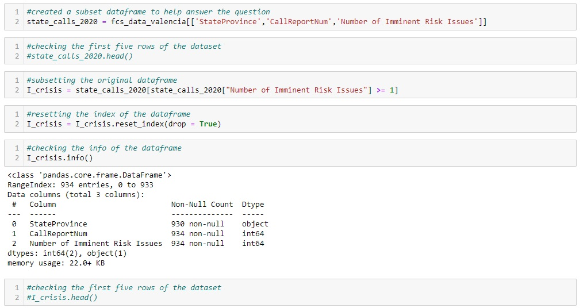

# fcs-project

# Introduction
For this project, our team was assigned with analyzing trends in Family and Children's Service calls to find any trends in call content for the years 2019 and 2020. For this project, our team used Python for data analysis and PowerPoint for presenting our findings.

I was assigned with finding the percentage of TN calls versus out of state calls, along with the percentage of TN imminent risk calls versus out of state imminent risk calls.

Data Sources: Due to the sensitive nature of the data provided, I am unable to provide the data used for this project.

# Table of Contents
* [Introduction](#Introduction)
* [Python Walkthrough](#Python-Walkthrough)
* [PowerPoint Presentation](#PowerPoint-Presentation)

# Python Walkthrough
1. Firstly I imported all packages I believed I would need for the project. The last dataset loaded in was a modified dataset from the original provided by our teammate Valencia. It includes numeric values for every imminent risk call.

2. For the second step, I needed to import the datasets provided, however the encoding used for the datasets was different than usual, so our team had to find an encoding that would work with the datasets.

3. Thirdly, I needed to check the head, shape, info, and list of columns in the datasets to properly understand the scope of the data our team was working with.

4. The next step involved subsetting the dataset provided by Valencia to only include the state, call report number, and the number of imminent risk issues reported.

5. For the fifth step, I took the state province column from the new dataframe and did a value count to find how many calls were imminent risk from out of state in 2020.

![Placeholder]

6. Next, I needed to create a dictionary to find the actual percentage of TN calls versus out of state calls. After creating a dictionary, I made a for loop to run through the dictionary, summing up the total count of calls, multiplying it by one hundred and dividing by the sum to find the final percentages.

![Placeholder]

7. For the seventh step, I created another for loop to fill the empty dictionary by dividing the crisis calls dictionary values by the total crisis calls to create the needed percentages.

![Placeholder]

8. Next, I create a plot that will show the final results. The bar plot required getting the range and length of the crisis call ratio dictionary made earlier as my x, and a list of all the values from that dictionary as my y. A similar process was used when plotting the xticks.

![Placeholder]

9. I repeated this process for the other two charts I created. Those being the percentage of TN calls versus out of state calls for the years 2019 and 2020.

![Placeholder]

10. Lastly, the final presentation is available to view below.

# PowerPoint Presentation
[PowerPoint Presentation](presentation/fcs_presentation.pdf)