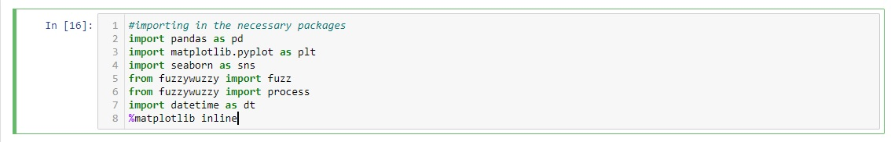

# fcs-project

# Introduction
For this project, our team was assigned with analyzing trends in Family and Children's Service calls to find any trends in call content. For this project, our team used Python for data analysis and PowerPoint for presenting our findings.

I was assigned with finding the percentage of TN calls versus out of state calls, along with the percentage of TN imminent risk calls versus out of state imminent risk calls.

Data Sources: Due to the sensitive nature of the data provided, I am unable to provide the data used for this project.

# Table of Contents
* [Introduction](#Introduction)
* [Python Walkthrough](#Python-Walkthrough)
* [PowerPoint Presentation](#PowerPoint-Presentation)

# Python Walkthrough
1. Firstly I imported all packages I believed I would need for the project.

2. 

3. 

4. 

5. 

6. 

7. 

8. 

9. 

10. 

11. 

12. 

# PowerPoint Presentation
[PowerPoint Presentation](presentation/fcs_presentation.pdf)